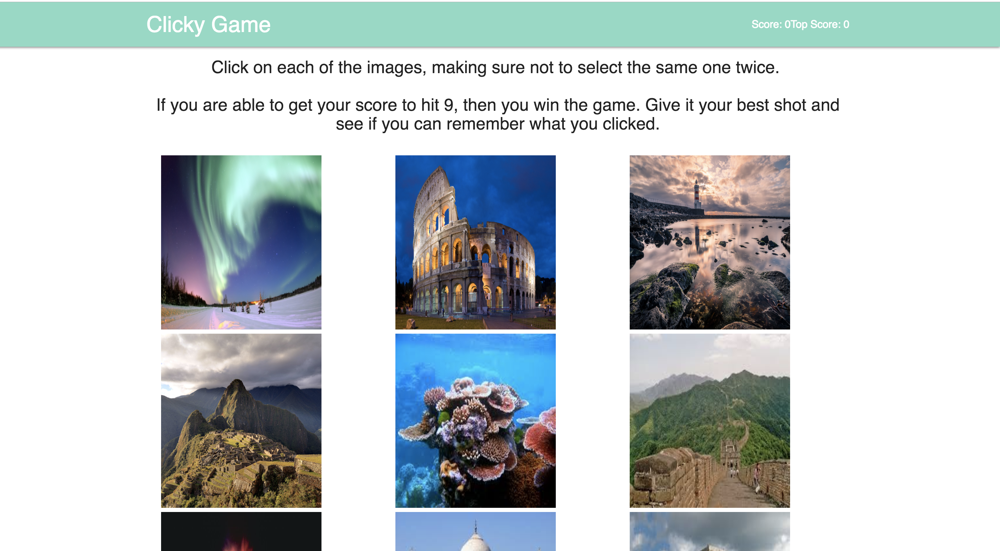

### Travel Memory Game
# reactMemoryGame

* Click on each of the images, making sure not to select the same one twice. If you are able to get your score to hit 9, then you win the game. Give it your best shot and see if you can remember what you clicked.
* Each image you click will give you a point.

### Getting Started
* Until further notice, the app can be run by cloning this repo to your machine and running "yarn start"

### Built With
* [React](https://reactjs.org/)
* [Materialize](http://materializecss.com/)

### Author
* Victoria Gonzalez - [VictoriaGoesPlaces](https://victoriagoesplaces.github.io/reactMemoryGame/)

### Screenshots

Game

